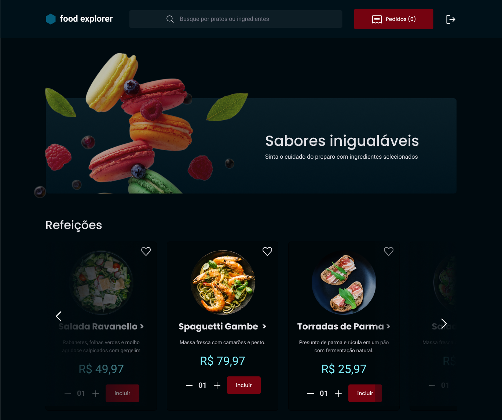

<h1>FoodExplorer</h1>

 

  

 

<h2> Sumário </h2>

1. [Sobre](#sobre)
2. [Tecnologias, Bibliotecas e Ferramentas](#tecnologias-bibliotecas-e-ferramentas)
3. [Autor](#autor)

## Sobre
O projeto foi desenvolvido como desafio final do programa [Explorer da Rocketseat](https://www.rocketseat.com.br/explorer). Ele segue a ideia de uma aplicação com cardápio interativo e digital para um restaurante fictício tendo 2 personas como foco principal: usuário administrador (dono do restaurante) e usuário comum (cliente).

- **Cliente**: 
  - tem acesso a home;
  - Pode Fazer a busca do prato pelo nome ou iniciais;
  - Visualiza os pratos de forma detalhada;
  - Adiciona produtos aos favoritos;
  - Consegue atualizar as informações de perfil (nome, e-mail, senha).
  
 

- **Administrador**: 
  - Cria/ cadastra pratos;
  - Edita os pratos já cadastrados;
  - Exclui o prato do catalogo.

 

**IMPORTANTE**: O frontend da aplicação encontra-se em desenvolvimento.

**OBS**: Para informações mais detalhadas, acessar o [Backend da aplicação](https://github.com/EltonPrado/Projeto23_FoodExplorer_Backend).

## Tecnologias, Bibliotecas e Ferramentas

Estão sendo utilizadas as seguintes tecnologias, bibliotecas e ferramentas para o desenvolvimento do frontend desse projeto:

- **JavaScript** - Faz toda a lógica da aplicação;
- **ReactJS** - Usado para construir as interfaces;
  - **NPM** - Realiza a instalação das dependências;
  - **Vite** - Usado para criar o projeto React;
  - **Styled-Components** - Faz a estilização da aplicação;
  - **Axios** - Utilizado para fazer as requisições.
  - **Deploy com netlify** - Utilizando a plataforma do netlify para fazer a hospedagem do frontend;
- **Git** - Responsável por realizar o gerenciamento de versionamento do código;
- **GitHub** - Utilizado para armazenar a aplicação em nuvem.

## Autor
Desenvolvido por [Elton Prado](https://www.linkedin.com/in/elton-prado/). :rocket: